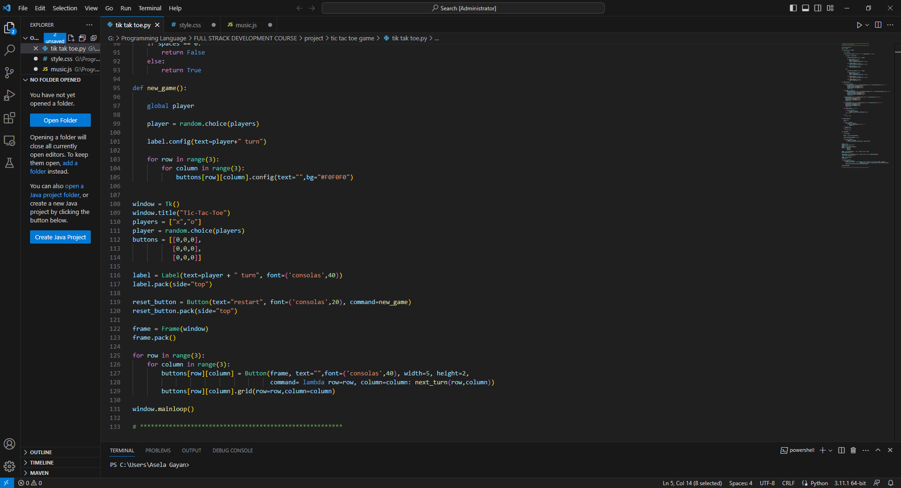

 

<h1> PYTHON----TIK-TAK-TOE-GAME</h1>

<h4>using python and tkinter </h4>

<h2>Introduction this TIK-TAK-TOE-GAME project</h2>
The Python Tic-Tac-Toe game is a classic two-player board game that challenges players to strategically place their markers (typically "X" and "O") on a 3x3 grid in an attempt to win by forming a horizontal, vertical, or diagonal line of their markers, or to end the game in a draw if there are no more available moves. This simple yet engaging game is commonly used for educational purposes and as a programming exercise for beginners to practice their coding skills.

<h3>Programming Implementation:</h3>

The Python Tic-Tac-Toe game can be implemented using basic Python programming concepts, including loops, conditional statements, functions, and data structures like lists or dictionaries. It can be developed as a console-based application or with a graphical user interface (GUI) using libraries like Tkinter.

Creating a Tic-Tac-Toe game in Python is an excellent way for beginners to practice and improve their programming skills. It involves:
<ul>
<li>Understanding the logic of game development.</li>
<li>Implementing user input and validation.</li>
<li>Learning about conditional statements and loops.</li>
<li>Managing data structures to represent the game board.</li>
<li>Developing error handling mechanisms.</li>
<li>Enhancing problem-solving skills.</li>
<li>Potentially exploring GUI development for a more polished user experience.</li>
  </ul>
Overall, the Python Tic-Tac-Toe game is a fun and educational project that allows programmers to apply their knowledge and creativity to build a classic game from scratch. It's a stepping stone for those interested in game development or exploring more complex programming projects in the future.

<h2>Project Code</h2>

<h2>Project GUI</h2>

